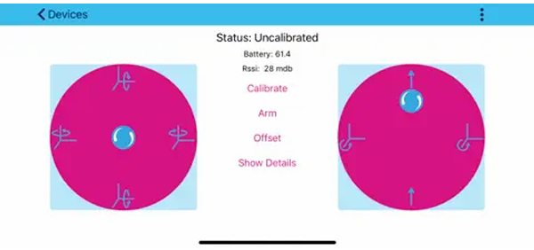
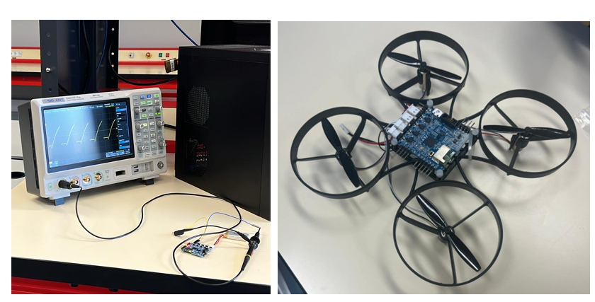
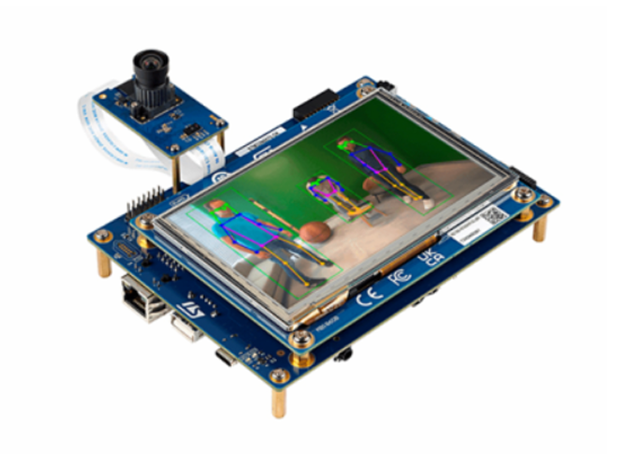
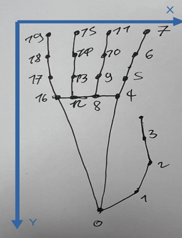

<div align="center">

# Gesture-Controlled Drone

### Pilotage d'un drone par gestes de la main — IA embarquée sur STM32N6 (NPU)

*Real-time hand-gesture drone control, fully on-device AI inference on an STM32N6 neural accelerator.*

<br>


<br>

`Computer Vision` · `Edge AI / NPU` · `Real-Time RTOS` · `BLE GATT` · `Sensor-to-Actuator Pipeline`

</div>

---

## En bref 

Un système embarqué qui **transforme les gestes de la main en commandes de vol**, sans aucune télécommande. Toute l'intelligence ,détection de la main et extraction de 21 points clés , tourne **directement sur le NPU de la carte STM32N6570-DK**, à pleine cadence vidéo, sans cloud ni GPU externe.

> A pure edge-AI control loop: a camera frame becomes a flight command in milliseconds, entirely on a microcontroller-class device.

| | |
|---|---|
| **IA embarquée** | 2 modèles chaînés (palm detector → hand landmark) sur NPU @ 1 GHz |
| **Temps réel** | Pipeline multitâche FreeRTOS, traitement à la cadence caméra |
| **7 gestes** | Reconnaissance par analyse géométrique de 21 landmarks |
| **Sans fil** | Transmission des commandes en BLE 4.0 vers le contrôleur de vol |

---

## Démo & Validation Hardware / Demo & Hardware Validation

<div align="center">
  
  
  <br>
  <sub><i>À gauche : Interface de l'application mobile de pilotage. À droite : Validation des signaux de commande à l'oscilloscope sur le quadricoptère.</i></sub>
</div>

<br>

<div align="center">

```
   Poing fermé          ->   STOP / hover
   Main inclinée droite ->   YAW droite
   Main à plat          ->   PITCH avant
```

</div>

---

## Architecture

```
+------------------------------------+    USB-CDC     +-------------+    BLE 4.0    +--------------------+
|         STM32N6570-DK              |  UART 115200    |  PC relay   |  GATT write   |   Drone ST DRN2100  |
|                                    |  ----------->   |  (Python)   |  ---------->  |                     |
|  VD66GY  ->  DCMIPP pipeline       |                 |             |   handle 36   |   ST-FCU001V2       |
|  NPU: palm det. -> hand landmark   |                 |  serial in  |   @ 20 Hz     |   BlueNRG-M0A       |
|  FreeRTOS: nn / dp / isp           |                 |  BLE relay  |               |   4 x DC motors     |
|  Gesture logic -> USART1           |                 |  (asyncio)  |               |   + IMU 3 axes / PID|
+------------------------------------+                 +-------------+               +--------------------+
```

### Pourquoi un relais PC ? / Why a PC relay?

Le module BLE initialement prévu côté STM32 (HM-10) s'est révélé **préconfiguré en mode AT**, sans accès aux caractéristiques GATT custom du drone. Plutôt que d'abandonner, un relais Python a été développé pour faire le pont UART → BLE et **valider la chaîne complète de bout en bout**.

> *Pragmatic engineering decision: when the chosen BLE module couldn't write custom GATT characteristics, a Python bridge proved the full pipeline end-to-end.*

---

## Pipeline IA / AI Pipeline

<div align="center">
  
  <br>
  <sub><i>Carte cible STM32N6570-DK dotée de son accélérateur matériel (NPU) et de son capteur caméra Edge AI.</i></sub>
</div>

<br>

Construit sur la démo **X-CUBE-N6-AI-Hand-Landmarks** de STMicroelectronics, étendu pour la commande de drone.

```
Caméra VD66GY
     |  DCMIPP Pipe2 -> buffer d'entrée NN
     v
Palm Detector  -->  bounding box + ROI orientée
     |  crop + resize (IPL / GPU2D NemaGFX)
     v
Hand Landmark  -->  21 points (x, y, z) - 63 floats
     |
     v
Gesture logic  -->  printf("forward\n")  ->  USART1
```

| Tâche FreeRTOS | Priorité | Rôle |
|----------------|:--------:|------|
| `isp_thread` | +2 | Mise à jour ISP / caméra |
| `nn_thread` | +1 | Inférence IA (palm + landmark) |
| `dp_thread` | −2 | Affichage LCD + reconnaissance gestes |

---

## Gestes reconnus / Gesture Set

<div align="center">
  
  <br>
  <sub><i>Cartographie géométrique et indexation des 21 landmarks de la main exploités par l'algorithme en C.</i></sub>
</div>

<br>

Chaque geste est défini par **comparaison géométrique des coordonnées** des 21 landmarks (indexation type MediaPipe). Aucun ML supplémentaire : une logique déterministe, lisible et déboguable.

| Geste | Détection (logique réelle du code) | Commande |
|-------|------------------------------------|----------|
| **STOP** | Main fermée — bouts de doigts repliés sous leurs articulations | hover |
| **FORWARD** | Main à plat, pouce à droite de l'auriculaire | pitch + |
| **BACKWARD** | Main à plat, pouce à gauche de l'auriculaire | pitch − |
| **LEFT** | Les quatre doigts à gauche du poignet | yaw − |
| **RIGHT** | Les quatre doigts à droite du poignet | yaw + |
| **UP** | Index au-dessus du majeur, pouce à droite | throttle + |
| **DOWN** | Index au-dessus du majeur, pouce à gauche | throttle − |

---

## Protocole BLE / BLE Protocol

```python
# Payload 7 octets -> GATT handle 36
# [0, yaw, throttle, roll, pitch, 0, command]
CALIBRATION = bytes([0, 0, 0, 0, 0, 0, 0x02])
ARMING      = bytes([0, 0, 0, 0, 0, 0, 0x04])
```

**Séquence :** calibration (1 s @ 20 Hz) → armement (1 s @ 20 Hz) → flux de commandes gestuelles.

---

## Détails techniques vérifiés / Verified Tech Specs

| Paramètre | Valeur |
|-----------|--------|
| CPU (Cortex-M55, PLL1) | **800 MHz** |
| NPU (PLL2) | **1000 MHz** |
| AXISRAM 3–6 (PLL3) | **900 MHz** |
| HCLK / APB | 200 MHz |
| Console UART | USART1 — PE5/PE6 (AF7), 115200 baud, 8N1 |
| Modèle landmark | 21 points · 63 floats |

---

## Contributions personnelles / My Contributions

> Projet d'équipe (4 étudiants, ENSEA S7). Mes apports spécifiques :

- **Logique de reconnaissance gestuelle** — définition et implémentation des 7 gestes dans `app.c`, par analyse géométrique des landmarks.
- **Relais BLE asynchrone** (`drone_control.py`) — lecture série STM32, traduction geste → payload 7-octets, transmission `asyncio` + `BleakClient` à 20 Hz.
- **Banc de test moteurs** (`throttle_test.py`) — rampe de throttle pour valider la chaîne BLE avant intégration.
- **Débogage bas-niveau BLE** — diagnostic de la limitation du module HM-10 (mode AT préconfiguré, pas d'accès GATT custom) via commandes AT sur USART.

---

## Démarrage / Getting Started

### Firmware (STM32CubeIDE + STM32CubeProgrammer)

```bash
# 1. Carte en Development mode (BOOT0), flasher les .hex du modèle IA :
#    ai_fsbl.hex · palm_detector_data.hex · hand_landmark_data.hex
#    x-cube-n6-ai-hand-landmarks-dk.hex

# 2. Compiler et flasher le firmware (STM32CubeIDE)
# 3. Repasser en "Boot from flash"
```

### Relais Python (Linux / WSL — Python ≥ 3.8)

```bash
pip install bleak pyserial
python python/drone_control.py
```

---

## Résultats / Results

- Reconnaissance des 7 gestes en temps réel, directement sur le NPU
- Chaîne complète validée de bout en bout : geste → inférence → UART → BLE → contrôleur de vol
- Réception des commandes confirmée à l'oscilloscope côté flight controller
- Contrôle effectif de la vitesse des moteurs en réponse aux gestes de la main

> The full sensor-to-actuator pipeline works end-to-end: a hand gesture is recognized on-device and drives the drone's motors over BLE in real time.

---

## Structure / Repository

```
drone-gesture-control/
├── firmware/                 # Code STM32 — licence ST SLA0044
│   ├── app.c                 # [perso] Pipeline IA + logique gestes
│   ├── main.c                # Init système, clocks, USART1
│   ├── app_cam.c             # DCMIPP, caméra VD66GY
│   ├── ld.c                  # Post-traitement landmarks
│   └── ...
├── python/
│   ├── drone_control.py      # [perso] Relais UART -> BLE GATT (20 Hz)
│   └── throttle_test.py      # [perso] Banc de test throttle
├── docs/
│   ├── images/               # Photos du projet
│   └── rapport_projet.pdf    # Rapport complet (équipe)
└── README.md
```

---

## Licence / License

| Composant | Licence |
|-----------|---------|
| Firmware C (dérivé de X-CUBE-N6-AI-Hand-Landmarks) | **SLA0044** — ST proprietary |
| Scripts Python | **MIT** |


---

## Références / References

- [X-CUBE-N6-AI-Hand-Landmarks — STMicroelectronics](https://github.com/STMicroelectronics/x-cube-n6-ai-hand-landmarks)
- [STM32N6570-DK — User Manual](https://www.st.com)
- [BlueNRG-M0A / FCU001V2 — STEVAL drone kit](https://www.st.com)

<div align="center">
<br>
<sub>Projet académique — ENSEA Cergy-Pontoise · Semestre 7 · 2025–2026</sub>
</div>
